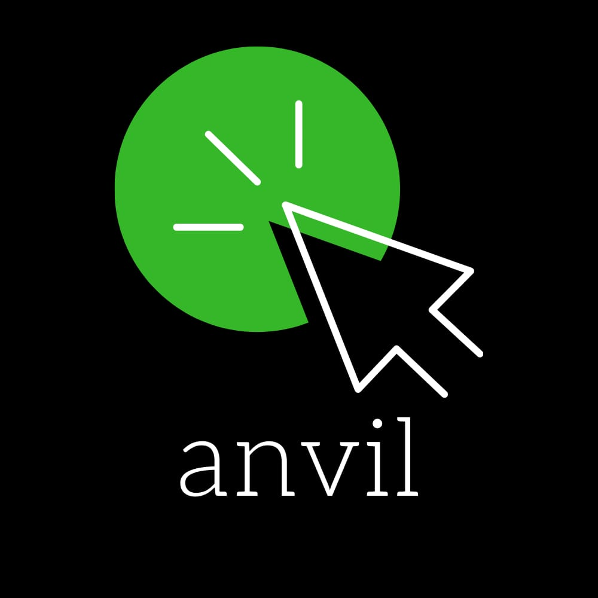

<!DOCTYPE html>
<html lang="en" dir="ltr">
  <head>
    <meta name="viewport" content="width=device-width, initial-scale=1">
    <meta name="description" content="Quality web development and design.">
    <meta name="keywords" content=" anvil, website, web-design, web-development, portfolio">
    <meta name=”robots” content="index, follow">
    <title>Anvil</title>
    <link rel="stylesheet" href="css/master.css">
    <link rel="icon" href="img/logo.jpg" type="image/gif" sizes="32x32">
    <link rel="stylesheet" href="https://cdnjs.cloudflare.com/ajax/libs/font-awesome/4.7.0/css/font-awesome.min.css">
    
    
  </head>
  <body onload="myFunction()">

    <!--Loader Start-->
    

      

    

    <!--Loader Start-->

    <section style="display:none;" id="myDiv" class="animate-bottom">
    <!--Menu-->
    

      

        
        
        
      

      

        
        
      

    

    <!--Menu-->

    <!--Header-->
    <section id="home">
    <header>
      

        <h2 id="anvil" class="line-1 anim-typewriter grad">	&ltAnvil\&gt</h2>
        
Web Development

        <i class="arrow down"></i>    <a href="#back">
Scroll Down
</a>
      

    </header>
    

      <h1 id="about_h">Who we are</h1>
      
Anvil is a technology company founded by young budding developers and designers who are
        enthusiastic about all things tech. We specialize in the making of websites and webapps
        with a mobile first approach and we aim to create visually stunning designs with high
        performance and accessibility.
      

    

    </section>
    <!--Header-->

    <!--Expertise Start-->
    <section id="expertise">
    

      

      <h1 class="grad">Services</h1>
      

        

          
<i class="fa fa-desktop"></i>

          <h3 class="title grad">Websites</h3>
          

            Responsive, mobile first, interactive websites for a variety of uses in different industries.
          

      

      

      

        

          
<i class="fa fa-shopping-cart"></i>

          <h3 class="title grad">Ecommerce </h3>
          

            Online stores to engage with and sell to your customers with great ease and convenience.
          

      

      

      

        

          
<i class="fa fa-mobile"></i>

          <h3 class="title grad">Web Apps</h3>
          

            Intuitive websites to gain more from users through convenient application like features.
          

      

    

    

    

    </section>
    <!--Expertise End-->

    <!--Projects-->
    <section id="portfolio">
      

          

            <h1 class="grad">Projects</h1>
           

             

               
               

               

                 <a href="https://www.quickfixtyres.co.ke/" target="_blank"><h3 class="title">Ecommerce Site</h3></a>
                 
Prestashop/Vanilla JS/HTML/PHP

               

             

           

           

             

               
               
               

               

                 <a href="https://dixonkimandu.github.io/Photography-website/" target="_blank"><h3 class="title">Photography Website</h3></a>
                 
Vanilla JS/HTML/CSS

               

             

           

           

             

               
               

               

                 <a href="http://ecodin.co.ke/" target="_blank"><h3 class="title">Landing Page</h3></a>
                 
Vanilla JS/HTML/CSS

               

             

           

          

            

              
              
              

              

                <a href="https://dixonkimandu.github.io/Glitchin/" target="_blank"><h3 class="title">Glitch Effect</h3></a>
                
Vanilla JS/HTML/CSS

              

            

          

          

            

              
              

              

                <a href="http://optimalprotect.co.ke/" target="_blank"><h3 class="title">Landing Page</h3></a>
                
Vanilla JS/HTML/CSS

              

            

          

          

            

              
              
              

              

                <a href="https://nzige-a8cae.web.app/" target="_blank"><h3 class="title">Web App</h3></a>
                
Node JS/Firebase/TensorFlow

              

            

          

      

    </section>
    <!--Projects-->

    <!--Footer-->
    <section class="footer">
        <footer>
          

            

              <h2>Contact Us</h2>
              
Nairobi, Kenya  
                +254719582599  
                +254705184745  
                254.anvil@gmail.com
                 
              

            

            

              
            

            

              <h2>Find Us</h2>
                <a href="https://m.facebook.com/anvil254/" target="_blank">
Facebook
</a>
                <a href="https://www.instagram.com/anvil_web_design/" target="_blank">
Instagram
</a>
            

          
<!--br>          <br-->
          
Made by Anvil Copyright &copy; 

           
        </footer>
    </section>
    <!--Footer-->

    <!--Menu Items-->
    

      

        <a href="#home">HOME</a>
        <a href="#about">ABOUT</a>
        <a href="#expertise">EXPERTISE</a>
        <a href="#portfolio">PORTFOLIO</a>
      

      <!--Menu Items-->

    </section>

    
    
  </body>
</html>
